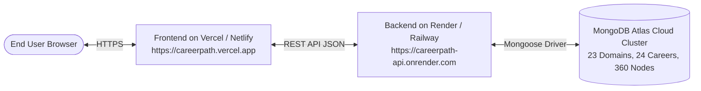

# 🚀 CareerPath: Complete Production Deployment Guide

This guide provides step-by-step instructions for deploying the **CareerPath** platform (Frontend, Express Backend, and MongoDB Atlas Database) to production on free-tier cloud platforms (Vercel + Render) or using Docker.

---

## 🏗️ Architecture Overview



---

## 📋 Pre-Deployment Checklist

Before deploying, ensure you have:
1. A **GitHub account** with the CareerPath repository pushed.
2. A **MongoDB Atlas account** (Free M0 cluster).
3. A **Vercel account** (for Frontend).
4. A **Render or Railway account** (for Backend).

---

## 🌐 OPTION A: Deploy to Cloud (Vercel + Render + MongoDB Atlas) — *Recommended*

### Step 1: Set Up MongoDB Atlas Database

1. Log into [MongoDB Atlas](https://www.mongodb.com/cloud/atlas).
2. Create a free **M0 Sandbox** cluster (or use your existing cluster `career-path-cluster`).
3. Under **Database Access**, create a user with read/write permissions.
4. Under **Network Access**, add `0.0.0.0/0` (allow access from anywhere) so Render/Vercel can connect.
5. Click **Connect** → **Drivers** and copy the connection string:
   ```text
   mongodb+srv://<username>:<password>@career-path-cluster.xxxxxx.mongodb.net/?appName=career-path-cluster
   ```

---

### Step 2: Deploy Backend to Render (or Railway)

1. Log into [Render.com](https://render.com) and click **New +** → **Web Service**.
2. Connect your GitHub repository: `career-path_V1`.
3. Configure the Web Service settings:
   - **Name**: `careerpath-api`
   - **Root Directory**: `server`
   - **Runtime**: `Node`
   - **Build Command**: `npm install && npm run build`
   - **Start Command**: `npm run start`
   - **Instance Type**: `Free`
4. Under **Environment Variables**, add:
   | Key | Value |
   | :--- | :--- |
   | `NODE_ENV` | `production` |
   | `PORT` | `5000` (or leave default Render port) |
   | `MONGODB_URI` | `mongodb+srv://<username>:<password>@career-path-cluster...` |
   | `JWT_SECRET` | `0QLEZzUyew6TdtW0w1Zqn0E/bAxZz56pK3LGlyeYA70=` (or your secure random string) |
   | `JWT_EXPIRES_IN` | `7d` |
   | `CORS_ORIGIN` | `*` (or your frontend Vercel URL once deployed) |
5. Click **Create Web Service**.
6. Once deployed, Render will provide your live API URL:
   ```text
   https://careerpath-api.onrender.com
   ```
7. Verify backend health by visiting in your browser:
   ```text
   https://careerpath-api.onrender.com/api/v1/health
   ```
   *(Expected response: `{"status":"ok","database":"connected"}`)*

---

### Step 3: Seed Database in Production

Once the backend is connected to MongoDB Atlas, run the seed script once to populate all 23 domains, 24 careers, 360 roadmap nodes, and 3,600+ questions:

**Option 1: From Render Shell (In Render Dashboard)**
Click the **Shell** tab in your Render service and run:
```bash
npx tsx src/scripts/seed.ts
```

**Option 2: From your Local Machine targeting the Production MongoDB URI**
In `career-path_V1/server`:
```powershell
npx.cmd tsx src/scripts/seed.ts
```

---

### Step 4: Deploy Frontend to Vercel

1. Log into [Vercel.com](https://vercel.com) and click **Add New...** → **Project**.
2. Import your GitHub repository: `career-path_V1`.
3. Configure project settings:
   - **Framework Preset**: `Vite`
   - **Root Directory**: `./` (Project root)
   - **Build Command**: `npm run build`
   - **Output Directory**: `dist`
   - **Install Command**: `npm install`
4. Under **Environment Variables**, add:
   | Key | Value |
   | :--- | :--- |
   | `VITE_API_URL` | `https://careerpath-api.onrender.com/api/v1` |
5. Click **Deploy**.
6. Vercel will build and launch your site:
   ```text
   https://careerpath.vercel.app
   ```

---

### Step 5: Update CORS on Backend

After obtaining your Vercel URL (e.g. `https://careerpath.vercel.app`), go back to **Render** → **Environment Variables** and update:
```text
CORS_ORIGIN=https://careerpath.vercel.app,http://localhost:5173
```
Render will automatically redeploy with strict CORS protection.

---

## 🐳 OPTION B: Deploy via Docker & Docker Compose

For deploying to AWS EC2, DigitalOcean Droplets, or a local VPS:

### 1. Build and Run Multi-Container Stack
From the project root:
```bash
docker compose up -d --build
```

### 2. Verify Running Containers
```bash
docker compose ps
```
- Frontend will be accessible at: `http://localhost` (or port 80/5173)
- Backend will be accessible at: `http://localhost:5000`
- MongoDB will be running on port `27017`

---

## 📦 How to Commit and Push to GitHub Repository

Follow these commands to stage all files, models, seed data, reports, and deployment configs into your Git repository:

```powershell
# 1. Check current status
git status

# 2. Stage all updated files and documentation
git add .

# 3. Commit with a descriptive message
git commit -m "feat: complete learning content, 3600+ questions, search, submissions, and production deployment config"

# 4. Push to remote repository
git push origin main
```

---

## 🧪 Post-Deployment Smoke Test Checklist

After deployment, test the live URL:

| Test Item | Action | Expected Result |
| :--- | :--- | :--- |
| **1. 3D Career Sky** | Navigate to `/sky` | 23 3D celestial domain planets render with Drei billboard labels |
| **2. Auth Flow** | Register a new user | JWT token generated, redirected to onboarding or sky |
| **3. Roadmap** | Open `/roadmap` for Android or Cyber Security | 15 learning steps load across 4 phases |
| **4. 10-Q Assessment** | Start assessment on any node | 10 MCQs load with timer; submitting saves score |
| **5. Coding Challenge** | Open code editor & submit | Code runs against test cases; score recorded |
| **6. Milestone Task** | Submit GitHub repo link | GitHub regex passes; submission recorded in MongoDB |
| **7. Search** | Search on `/resources` and `/projects` | Live results filter instantly without reload |
| **8. Multi-User** | Log into User 2 | Starts fresh with 0 progress; User 1 data is isolated |

---

🎉 **Your CareerPath platform is now production-ready and fully deployable!**
