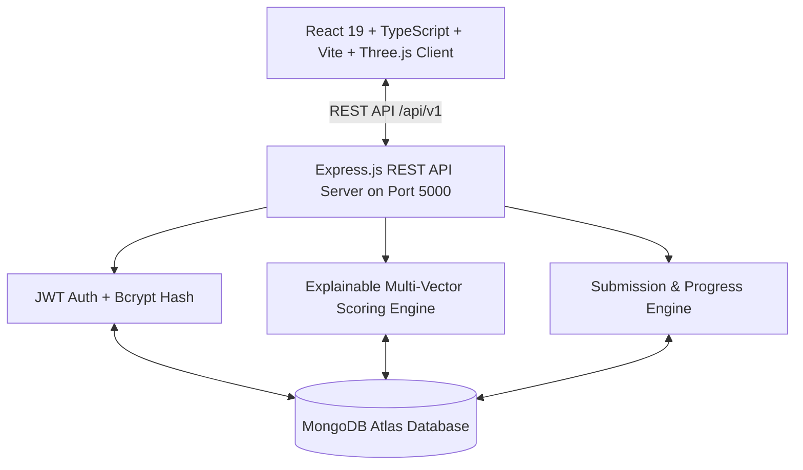

# CareerPath: Comprehensive Page-by-Page & Feature Explanation Guide
### *Technical Blueprint, Architectural Rationale, and Viva Presentation Scripts*

---

## 📑 TABLE OF CONTENTS

1. [System Overview & Architecture Summary](#1-system-overview--architecture-summary)
2. [Master Page-by-Page Breakdown](#2-master-page-by-page-breakdown)
   - [Page 1: Landing & Hero Page (`/`)](#page-1-landing--hero-page-)
   - [Page 2: User Authentication & Security (`/auth/login` & `/auth/register`)](#page-2-user-authentication--security-authlogin--authregister)
   - [Page 3: 4-Step Interactive Onboarding Flow (`/onboarding`)](#page-3-4-step-interactive-onboarding-flow-onboarding)
   - [Page 4: 3D Career Sky Celestial Navigation (`/sky`)](#page-4-3d-career-sky-celestial-navigation-sky)
   - [Page 5: Career Selection & Comparison Matrix (`/careers/compare`)](#page-5-career-selection--comparison-matrix-careerscompare)
   - [Page 6: Deep-Dive Career Details (`/career/:careerId`)](#page-6-deep-dive-career-details-careercareerid)
   - [Page 7: 15-Step Dynamic Roadmap & Flowchart (`/roadmap`)](#page-7-15-step-dynamic-roadmap--flowchart-roadmap)
   - [Page 8: Interactive Course Player (`/roadmap/course/:nodeId`)](#page-8-interactive-course-player-roadmapcoursenodeid)
   - [Page 9: 10-Question Assessment & Grading Engine (`/roadmap/assessment/:nodeId`)](#page-9-10-question-assessment--grading-engine-roadmapassessmentnodeid)
   - [Page 10: In-Browser Code Challenge & Runner (`/roadmap/challenge/:nodeId`)](#page-10-in-browser-code-challenge--runner-roadmapchallengenodeid)
   - [Page 11: Milestone Project & GitHub Submission (`/roadmap/task/:nodeId`)](#page-11-milestone-project--github-submission-roadmaptasknodeid)
   - [Page 12: Learning Resources & Search Engine (`/resources`)](#page-12-learning-resources--search-engine-resources)
   - [Page 13: Project Portfolio & Search Engine (`/projects`)](#page-13-project-portfolio--search-engine-projects)
   - [Page 14: Skill Gap Analysis & Diagnostic Report (`/skill-gap`)](#page-14-skill-gap-analysis--diagnostic-report-skill-gap)
   - [Page 15: Career Readiness Index (`/readiness`)](#page-15-career-readiness-index-readiness)
   - [Page 16: Profile Reflection & Identity Hub (`/profile/reflection` & `/profile`)](#page-16-profile-reflection--identity-hub-profilereflection--profile)
   - [Page 17: User Progress Dashboard & Analytics (`/progress`)](#page-17-user-progress-dashboard--analytics-progress)
   - [Page 18: Gamification & Achievements Gallery (`/achievements`)](#page-18-gamification--achievements-gallery-achievements)
3. [Key Core Algorithms & Technical Pipelines](#3-key-core-algorithms--technical-pipelines)
4. [Viva Voce & Technical Defense Script](#4-viva-voce--technical-defense-script)

---

## 1. SYSTEM OVERVIEW & ARCHITECTURE SUMMARY

**CareerPath** is a full-stack, enterprise-grade AI-powered career navigation and technical skill acquisition platform.



### Core Verified Database Metrics (MongoDB Atlas)
- **23 Celestial Domains & 53 Subdomains**: Full 3D orbital vectors `[x, y, z]` and theme palettes.
- **24 Comprehensive Careers**: Across Web, AI/ML, Cloud, Cyber Security, Mobile, Quantum, and Robotics.
- **24 15-Step Roadmaps (360 Nodes)**: Structured across 4 phases (*Foundation, Core, Advanced, Launch*).
- **360 Assessments with 3,600+ Questions**: Exactly 10 meaningful, topic-specific MCQs per node.
- **360 Courses, 360 Coding Challenges & 360 Practical Tasks**: 1:1 mapped to every single roadmap step.
- **43 Portfolio Projects & 42 Verified Resources**: With multi-field search and flexible filtering.

---

## 2. MASTER PAGE-BY-PAGE BREAKDOWN

---

### Page 1: Landing & Hero Page (`/`)

#### 1. Purpose & Why We Used This
The Landing Page provides the initial onboarding gateway, explaining the core value proposition of CareerPath: replacing static career counseling with an AI-driven, 3D visual, step-by-step verified learning path.

#### 2. Technical Framework & Components
- **File**: [`src/pages/LandingPage.tsx`](file:///c:/Users/aknai/career-path_V1/src/pages/LandingPage.tsx)
- **UI Libraries**: Tailwind CSS, Framer Motion (`initial`, `animate`, `whileHover`), Lucide React icons (`Compass`, `Sparkles`, `TrendingUp`, `CheckCircle`).
- **State Hooks**: `useNavigate` for immediate routing to `/onboarding` or `/sky`.

#### 3. Backend & Database Integration
- Fetches domain counts and career market highlights via `GET /api/v1/domains` and `GET /api/v1/news`.

#### 4. How It Works
1. Hero section displays an animated headline and dynamic CTA buttons (*"Discover Your Path"* and *"Explore 3D Career Sky"*).
2. Features grid breaks down the 4 pillars: *3D Spatial Navigation, Explainable AI Recommendations, Step-by-Step Roadmaps, and Verifiable Career Readiness*.
3. Live salary trends and market readiness badges show real-time market data.

#### 5. Expected Output
- High-conversion responsive landing interface with dark-mode glassmorphism, glowing gradient accents, and direct entry points.

#### 6. 🗣️ Presentation / Viva Script
> *"Professors, this is our Landing Page. Unlike standard educational websites that show static lists of degrees, CareerPath immediately introduces students to an interactive career guidance ecosystem. It features responsive micro-animations powered by Framer Motion, highlights our 4 core modules, and lets students jump directly into AI onboarding or the 3D celestial sky."*

---

### Page 2: User Authentication & Security (`/auth/login` & `/auth/register`)

#### 1. Purpose & Why We Used This
Ensures secure user onboarding, session persistence, and strict multi-user progress isolation so that User 1's completed courses, test scores, and GitHub submissions are never visible or shared with User 2.

#### 2. Technical Framework & Components
- **Files**: [`src/pages/auth/LoginPage.tsx`](file:///c:/Users/aknai/career-path_V1/src/pages/auth/LoginPage.tsx), [`src/pages/auth/RegisterPage.tsx`](file:///c:/Users/aknai/career-path_V1/src/pages/auth/RegisterPage.tsx)
- **Security Middleware**: `bcryptjs` (salt rounds: 10), `jsonwebtoken` (JWT expiry: 7 days), `helmet`, `express-rate-limit`, `mongo-sanitize`.

#### 3. Backend & Database Integration
- **Endpoints**: `POST /api/v1/auth/register`, `POST /api/v1/auth/login`, `GET /api/v1/auth/me`.
- **Model**: [`User.model.ts`](file:///c:/Users/aknai/career-path_V1/server/src/models/User.model.ts) with encrypted passwords, custom avatars, and nested `progress` schemas.

#### 4. How It Works
1. User enters name, email, password, and selects an avatar emoji.
2. Backend checks for unique email, hashes password with `bcrypt`, generates a signed JWT token, and initializes empty progress vectors.
3. Token is stored in `localStorage` under `career_path_token` and automatically attached via Axios interceptors in [`api.ts`](file:///c:/Users/aknai/career-path_V1/src/services/api.ts).

#### 5. Expected Output
- Instant authentication with success toast notifications, automatic session restoration, and protected route access.

#### 6. 🗣️ Presentation / Viva Script
> *"Security and multi-user isolation are core design requirements. Our authentication system uses JWT tokens with 7-day lifespans and bcrypt password hashing with 10 salt rounds. Every progress node, test score, and GitHub submission is strictly mapped to the authenticated user's MongoDB ObjectId, guaranteeing complete data isolation across different users."*

---

### Page 3: 4-Step Interactive Onboarding Flow (`/onboarding`)

#### 1. Purpose & Why We Used This
Captures multidimensional candidate attributes (technical skills, interests, hobbies, education, preferred work style, time horizon) required by the Explainable AI Recommendation Engine.

#### 2. Technical Framework & Components
- **File**: [`src/pages/onboarding/OnboardingPage.tsx`](file:///c:/Users/aknai/career-path_V1/src/pages/onboarding/OnboardingPage.tsx)
- **Architecture**: 4-Step Animated Wizard:
  - *Step 1: Background & Education*
  - *Step 2: Technical Skills & Proficiency*
  - *Step 3: Domain Interests & Passions*
  - *Step 4: Work Environment & 5-Year Vision*
- **State Management**: Local form state synced with `CareerContext.tsx`.

#### 3. Backend & Database Integration
- **Endpoint**: `POST /api/v1/users/onboarding` and `POST /api/v1/recommendations/evaluate`.
- Saves responses to `user.onboardingData` in MongoDB.

#### 4. How It Works
1. Progress bar reflects completion from Step 1 to 4 with animated transitions.
2. Clicking pills toggles skill badges with visual feedback.
3. Submitting Step 4 triggers the Explainable AI Recommendation Engine, calculating compatibility scores across all 24 careers.

#### 5. Expected Output
- Completed student profile stored in MongoDB and immediate navigation to AI recommendations or 3D Career Sky.

#### 6. 🗣️ Presentation / Viva Script
> *"Our 4-step onboarding questionnaire gathers multidimensional user signals. Rather than asking a single vague question, we collect academic background, existing technical skills, work style preferences, and long-term vision. This forms the mathematical input vector for our AI scoring model."*

---

### Page 4: 3D Career Sky Celestial Navigation (`/sky`)

#### 1. Purpose & Why We Used This
Replaces boring tabular lists with an engaging, interactive 3D celestial universe where 23 career domains appear as glowing celestial bodies positioned in a 3D coordinate space.

#### 2. Technical Framework & Components
- **File**: [`src/pages/career-sky/CareerSkyPage.tsx`](file:///c:/Users/aknai/career-path_V1/src/pages/career-sky/CareerSkyPage.tsx)
- **3D Libraries**: `@react-three/fiber` (Canvas), `@react-three/drei` (`OrbitControls`, `Html` 3D Billboards, `Stars`, `Float`), `three.js`.
- **Performance Optimizations**:
  - `dpr={[1, 1.5]}` prevents GPU overload on 4K/retina displays.
  - `webglcontextrestored` event listener ensures seamless GPU recovery.
  - Drei `<Html distanceFactor={25}>` projects dynamic 2D billboard badges directly into 3D world space above each cloud sphere.

#### 3. Backend & Database Integration
- **Endpoint**: `GET /api/v1/domains`.
- **Model**: [`Domain.model.ts`](file:///c:/Users/aknai/career-path_V1/server/src/models/Domain.model.ts) providing `position: [x, y, z]`, `theme.primaryColor`, `subDomains`, and career counts.

#### 4. How It Works
1. User orbits with mouse drag and zooms with scroll wheel.
2. Clicking a domain smoothly animates the camera (`CAMERA_VIEW = DOMAIN_VIEW`), opening the Subdomain selection panel on the left.
3. Clicking a subdomain reveals career cards on the right with salary, market demand, and difficulty metrics.
4. Clicking *"Explore Career Path"* selects that career and transitions to its 15-step roadmap.

#### 5. Expected Output
- Ultra-smooth 60fps 3D celestial galaxy with glowing planets, orbital rings, HTML name tags, and slide-in glassmorphic panels.

#### 6. 🗣️ Presentation / Viva Script
> *"Here is the Career Sky 3D engine. Built using Three.js and React Three Fiber, all 23 domains are positioned dynamically using [x, y, z] vectors fetched from MongoDB Atlas. Notice the Drei 3D billboard labels floating above each sphere. Clicking any domain smoothly repositions the camera and loads its subdomains and careers in real-time."*

---

### Page 5: Career Selection & Comparison Matrix (`/careers/compare`)

#### 1. Purpose & Why We Used This
Allows users to compare up to 3 candidate careers side-by-side across salary, market demand, difficulty, duration, prerequisite skills, and daily responsibilities to make an informed career decision.

#### 2. Technical Framework & Components
- **File**: [`src/pages/CareerComparisonPage.tsx`](file:///c:/Users/aknai/career-path_V1/src/pages/CareerComparisonPage.tsx)
- **Components**: Comparison matrix table, radar metrics, match scores, pros/cons breakdown.

#### 3. Backend & Database Integration
- **Endpoints**: `GET /api/v1/careers`, `POST /api/v1/careers/compare`.

#### 4. How It Works
1. Reads selected careers from `CareerContext` (e.g. *Android Developer* vs *Ethical Hacker* vs *DevOps Engineer*).
2. Computes side-by-side comparison vectors for average salary, learning curve, growth rate, and required tech stack.
3. Allows one-click career switching to instantly adopt the winning path.

#### 5. Expected Output
- High-density comparative dashboard with color-coded score indicators and direct roadmap activation buttons.

#### 6. 🗣️ Presentation / Viva Script
> *"Students often struggle to choose between similar careers like Frontend vs Mobile or DevOps vs Security. Our Multi-Career Comparison Matrix allows side-by-side evaluation across 8 critical dimensions, including compensation bands, market growth rate, and prerequisite skills."*

---

### Page 6: Deep-Dive Career Details (`/career/:careerId`)

#### 1. Purpose & Why We Used This
Presents an exhaustive profile for any chosen career, including role overview, industry demand, market compensation benchmarks, required core skills, and day-in-the-life walkthrough.

#### 2. Technical Framework & Components
- **File**: [`src/pages/CareerDetailsPage.tsx`](file:///c:/Users/aknai/career-path_V1/src/pages/CareerDetailsPage.tsx)
- **UI Components**: Salary gauges, skill taxonomy badges, career progression timeline (*Junior → Mid → Senior → Lead*).

#### 3. Backend & Database Integration
- **Endpoint**: `GET /api/v1/careers/:careerId`.
- **Model**: [`Career.model.ts`](file:///c:/Users/aknai/career-path_V1/server/src/models/Career.model.ts).

#### 4. How It Works
1. Fetches career metadata from MongoDB via URL param `:careerId`.
2. Renders career description, salary ranges, required skill competencies, and sample job titles.
3. Displays *"Start Learning Path"* CTA that initializes the user's roadmap.

#### 5. Expected Output
- Comprehensive career portfolio briefing with immediate navigation into the learning roadmap.

#### 6. 🗣️ Presentation / Viva Script
> *"This is the Career Details page. It pulls verified industrial data from MongoDB, showing students the exact salary expectations across experience tiers, market demand indexes, and the progressive skills they need to master."*

---

### Page 7: 15-Step Dynamic Roadmap & Flowchart (`/roadmap`)

#### 1. Purpose & Why We Used This
The central learning hub of CareerPath. Translates a chosen career into a structured, step-by-step **15-node curriculum across 4 phases** (*Foundation, Core, Advanced, Launch & Capstone*).

#### 2. Technical Framework & Components
- **Files**: [`src/pages/RoadmapPage.tsx`](file:///c:/Users/aknai/career-path_V1/src/pages/RoadmapPage.tsx), [`src/components/roadmap/RoadmapFlowDiagram.tsx`](file:///c:/Users/aknai/career-path_V1/src/components/roadmap/RoadmapFlowDiagram.tsx)
- **Features**:
  - **Roadmap Topic Search**: `[ 🔍 Search roadmap topics... ]` with clear button for real-time skill and node filtering.
  - **Interactive Flow Diagram**: SVG flowchart modal showing topological prerequisites, phase boundaries, and status color codes (*Completed, In-Progress, Available, Locked*).
  - **Auto-Scroll Anchor**: Clicking any node in the flow diagram closes the modal and smoothly scrolls to that step in the roadmap list.
  - **Multi-Learning Action Drawer**: Every node expands to reveal buttons for:
    1. *Course Video/Reading (`/roadmap/course/:nodeId`)*
    2. *10-Question Timed Assessment (`/roadmap/assessment/:nodeId`)*
    3. *Interactive Code Challenge (`/roadmap/challenge/:nodeId`)*
    4. *Practical Milestone Task (`/roadmap/task/:nodeId`)*

#### 3. Backend & Database Integration
- **Endpoints**: `GET /api/v1/roadmaps/:careerId`, `POST /api/v1/roadmaps/start`, `POST /api/v1/roadmaps/complete-node/:nodeId`.
- **Model**: [`Roadmap.model.ts`](file:///c:/Users/aknai/career-path_V1/server/src/models/Roadmap.model.ts).

#### 4. How It Works
1. Fetches the active career's roadmap from MongoDB.
2. Dynamically evaluates node statuses based on `user.progress.completedNodeIds`.
3. Prerequisites enforce strict topological progression: Phase 2 unlocks only after Phase 1 foundation nodes are completed.
4. Total progress bar recalculates automatically `(completedCount / totalNodes * 100)`.

#### 5. Expected Output
- Interactive 15-step sequential learning track with instant search, interactive flowchart graph, and module action cards.

#### 6. 🗣️ Presentation / Viva Script
> *"This is the heart of our learning engine: the 15-Step Dynamic Roadmap. Every one of our 24 careers in MongoDB Atlas has exactly 15 nodes organized into 4 phases. Students can use our real-time search bar to highlight specific tools like 'Compose' or 'Docker', or open the interactive SVG Flow Diagram to visualize prerequisites. Clicking any node takes the student directly to its course, assessment, coding challenge, or practical task."*

---

### Page 8: Interactive Course Player (`/roadmap/course/:nodeId`)

#### 1. Purpose & Why We Used This
Delivers structured interactive lessons, reading materials, architectural diagrams, and video walkthroughs for every roadmap node.

#### 2. Technical Framework & Components
- **File**: [`src/pages/CoursePage.tsx`](file:///c:/Users/aknai/career-path_V1/src/pages/CoursePage.tsx)
- **UI Components**: Module accordion, lesson completion checkmarks, markdown content reader, external official documentation launch button.

#### 3. Backend & Database Integration
- **Endpoints**: `GET /api/v1/courses/:nodeId`, `POST /api/v1/courses/:nodeId/lessons/:lessonId/complete`.
- **Model**: [`Course.model.ts`](file:///c:/Users/aknai/career-path_V1/server/src/models/Course.model.ts). All 360 roadmap nodes have complete courses in MongoDB.

#### 4. How It Works
1. Fetches course modules and lessons mapped to `:nodeId`.
2. Marks lessons as completed upon finishing reading/exercises.
3. Updates user's `courseProgress` in MongoDB.

#### 5. Expected Output
- Full course curriculum view with progress tracking, lesson navigation, and direct assessment links.

#### 6. 🗣️ Presentation / Viva Script
> *"Every roadmap step has a dedicated course in MongoDB. Students can progress through structured modules, mark individual lessons as complete, and review key learning objectives before attempting tests."*

---

### Page 9: 10-Question Assessment & Grading Engine (`/roadmap/assessment/:nodeId`)

#### 1. Purpose & Why We Used This
Validates conceptual understanding through a timed, rigorous, 10-question multiple choice assessment generated specifically for each roadmap node topic.

#### 2. Technical Framework & Components
- **File**: [`src/pages/AssessmentPage.tsx`](file:///c:/Users/aknai/career-path_V1/src/pages/AssessmentPage.tsx)
- **Components**: [`QuestionCard.tsx`](file:///c:/Users/aknai/career-path_V1/src/components/assessment/QuestionCard.tsx), [`TestTimer.tsx`](file:///c:/Users/aknai/career-path_V1/src/components/assessment/TestTimer.tsx), [`TestResult.tsx`](file:///c:/Users/aknai/career-path_V1/src/components/assessment/TestResult.tsx).
- **Features**:
  - Live countdown timer (15 minutes).
  - Question navigation palette with status indicators (Q1 to Q10).
  - Previous / Next controls.
  - Server-side grading with 70% passing threshold.
  - Detailed report card displaying score, Pass/Fail status, chosen answer, correct answer, and full technical explanations.

#### 3. Backend & Database Integration
- **Endpoints**: `GET /api/v1/assessments/:nodeId`, `POST /api/v1/assessments/:nodeId/submit`.
- **Model**: [`Assessment.model.ts`](file:///c:/Users/aknai/career-path_V1/server/src/models/Assessment.model.ts). **All 360 roadmap nodes have assessments with 10+ questions (3,600+ questions in MongoDB Atlas)**.

#### 4. How It Works
1. On start, loads 10 topic-specific questions from MongoDB.
2. User selects choices; timer alerts user when under 2 minutes.
3. Submitting calculates percentage score, records attempt in MongoDB `user.learning.assessmentScores[nodeId]`, and unlocks milestone achievements if passed.

#### 5. Expected Output
- Interactive exam interface with instant result breakdown and comprehensive explanations for every question.

#### 6. 🗣️ Presentation / Viva Script
> *"Our assessment engine guarantees rigorous technical evaluation. Every single one of the 360 nodes across all 24 careers has at least 10 meaningful questions in MongoDB — that is over 3,600 questions in total! The platform enforces a 70% passing score, tracks attempts per user, and provides full technical rationales for every correct answer."*

---

### Page 10: In-Browser Code Challenge & Runner (`/roadmap/challenge/:nodeId`)

#### 1. Purpose & Why We Used This
Enables hands-on programming practice directly in the browser with starter code, automated test cases, hint revelation, and GitHub solution repository linking.

#### 2. Technical Framework & Components
- **File**: [`src/pages/CodingChallengePage.tsx`](file:///c:/Users/aknai/career-path_V1/src/pages/CodingChallengePage.tsx)
- **Features**:
  - Multi-language code editor (Kotlin, Python, TypeScript, Java).
  - Automated test case execution with input/expected output matching.
  - Progressive hint unlock system.
  - Solution repository link input (`https://github.com/...`) with live validation.
  - Implementation notes and file attachment support.
  - Previous submission history panel.

#### 3. Backend & Database Integration
- **Endpoints**: `GET /api/v1/challenges/:nodeId`, `POST /api/v1/challenges/:nodeId/run`, `POST /api/v1/challenges/:nodeId/submit`, `POST /api/v1/submissions`.
- **Models**: [`CodingChallenge.model.ts`](file:///c:/Users/aknai/career-path_V1/server/src/models/CodingChallenge.model.ts), [`Submission.model.ts`](file:///c:/Users/aknai/career-path_V1/server/src/models/Submission.model.ts).

#### 4. How It Works
1. Loads starter code and test cases for `:nodeId`.
2. Clicking *"Run Test Cases"* executes code against test assertions.
3. Clicking *"Submit Solution"* persists code score, GitHub URL, notes, and file attachments to MongoDB.

#### 5. Expected Output
- Split-screen challenge view with real-time test case status chips (*Passed/Failed*) and persistent submission history.

#### 6. 🗣️ Presentation / Viva Script
> *"Theoretical learning is not enough for engineering roles. Our Coding Challenge page provides a built-in code editor tailored to the career's primary language. Students run tests against automated assertions and can submit their GitHub solution repository directly into MongoDB."*

---

### Page 11: Milestone Project & GitHub Submission (`/roadmap/task/:nodeId`)

#### 1. Purpose & Why We Used This
Validates real-world software engineering competencies through production-grade milestone project requirements, deliverables checklists, live deployment links, and GitHub repository verification.

#### 2. Technical Framework & Components
- **Files**: [`src/pages/TaskPage.tsx`](file:///c:/Users/aknai/career-path_V1/src/pages/TaskPage.tsx), [`src/components/tasks/GitHubSubmission.tsx`](file:///c:/Users/aknai/career-path_V1/src/components/tasks/GitHubSubmission.tsx)
- **Features**:
  - Milestone timer and duration countdown.
  - Mandatory requirement checklist.
  - GitHub URL regex validator (`https://github.com/username/repository`).
  - Optional Live Deployment URL validator.
  - Implementation notes & architecture summary input.
  - File upload / attachment (ZIP, PDF, source archive).
  - Status badge (*Not Submitted, In Progress, Submitted to MongoDB, Under Review, Passed*).

#### 3. Backend & Database Integration
- **Endpoints**: `GET /api/v1/tasks/:nodeId`, `POST /api/v1/tasks/:nodeId/start`, `POST /api/v1/tasks/:nodeId/submit`, `POST /api/v1/submissions`.
- **Models**: [`Task.model.ts`](file:///c:/Users/aknai/career-path_V1/server/src/models/Task.model.ts), [`Submission.model.ts`](file:///c:/Users/aknai/career-path_V1/server/src/models/Submission.model.ts).

#### 4. How It Works
1. Student clicks *"Start Task"*, initializing the milestone deadline timer.
2. After building the project, student enters their GitHub URL, deployed URL, notes, and optional file archive.
3. Submitting records the submission in the MongoDB `submissions` collection and updates `user.learning.taskSubmissions[nodeId]`.

#### 5. Expected Output
- Verified milestone submission record with clickable links, timestamps, and progress badges.

#### 6. 🗣️ Presentation / Viva Script
> *"The Practical Task system bridges the gap to industrial readiness. Students build full milestone projects, check off deliverables, and submit their GitHub repository and deployed URL. Submissions are stored in our dedicated MongoDB Submissions collection under the student's authenticated ID."*

---

### Page 12: Learning Resources & Search Engine (`/resources`)

#### 1. Purpose & Why We Used This
Curates external books, official documentation, courses, video series, and interactive platforms linked to specific careers and skills, backed by a real-time multi-field search engine.

#### 2. Technical Framework & Components
- **File**: [`src/pages/ResourcesPage.tsx`](file:///c:/Users/aknai/career-path_V1/src/pages/ResourcesPage.tsx)
- **Features**:
  - **Real-Time Search Bar**: `[ 🔍 Search resources by title, topic, skill, provider... ]` with clear button.
  - **Type Filter Pills**: *All Types, Courses, Books, Practice, Docs, Video, Articles*.
  - **Career Filter Carousel**: Filter resources by any of the 24 careers.
  - **Completion Toggle**: *"Mark Done"* toggles resource completion in user progress.

#### 3. Backend & Database Integration
- **Endpoints**: `GET /api/v1/resources?search=...&careerId=...&type=...`, `POST /api/v1/resources/:resourceId/complete`.
- **Model**: [`Resource.model.ts`](file:///c:/Users/aknai/career-path_V1/server/src/models/Resource.model.ts).

#### 4. How It Works
1. User types in search query (e.g. *"Docker"*, *"Kotlin"*, *"AWS"*).
2. Performs multi-field search against title, description, provider, level, and skill tags.
3. Clicking *"Open Resource"* launches the verified external URL; *"Mark Done"* persists completion to MongoDB.

#### 5. Expected Output
- Filtered resource cards with ratings, difficulty badges, price tags (*Free / Paid*), and completion status.

#### 6. 🗣️ Presentation / Viva Script
> *"Our Resources page features a full multi-field search engine. Students can filter resources by type, difficulty level, or search across topics and tools like Docker, Kotlin, or React. Clicking 'Mark Done' updates the student's resources consumed count in MongoDB."*

---

### Page 13: Project Portfolio & Search Engine (`/projects`)

#### 1. Purpose & Why We Used This
Showcases resume-ready portfolio projects tailored to the user's chosen career with architecture objectives, tech stack breakdowns, and starter repository templates.

#### 2. Technical Framework & Components
- **File**: [`src/pages/ProjectsPage.tsx`](file:///c:/Users/aknai/career-path_V1/src/pages/ProjectsPage.tsx)
- **Features**:
  - **Real-Time Search Bar**: `[ 🔍 Search projects by title, tech stack, skill... ]` with clear button.
  - **Difficulty Filter**: *All, Starter, Intermediate, Advanced, Capstone*.
  - **Career Filter Carousel**: Filter portfolio projects by active career.
  - **Project Expansion**: Expandable accordion detailing long description, key objectives, and tech stack tags.
  - **Status Tracker**: *"Not Started"*, *"In Progress"*, *"Completed"*.

#### 3. Backend & Database Integration
- **Endpoints**: `GET /api/v1/projects?search=...&careerId=...&difficulty=...`, `PATCH /api/v1/projects/:projectId/status`.
- **Model**: [`Project.model.ts`](file:///c:/Users/aknai/career-path_V1/server/src/models/Project.model.ts).

#### 4. How It Works
1. Filters portfolio pieces matching the user's selected career and difficulty tier.
2. Clicking *"Start Building"* marks the project status as *In Progress* in MongoDB.
3. Clicking *"Repo Template"* opens the GitHub repository blueprint.

#### 5. Expected Output
- Portfolio readiness counter (*X / Y Ready*), detailed project blueprints, and real-time status management.

#### 6. 🗣️ Presentation / Viva Script
> *"Projects are critical for job placement. Our Projects page indexes 43 portfolio-worthy projects across all careers. Students can search by tech stack like PyTorch or Spring Boot, view key architecture objectives, and track completed portfolio pieces in their profile."*

---

### Page 14: Skill Gap Analysis & Diagnostic Report (`/skill-gap`)

#### 1. Purpose & Why We Used This
Performs an automated gap analysis comparing a student's acquired skills against the industrial requirements of their target career.

#### 2. Technical Framework & Components
- **File**: [`src/pages/SkillGapPage.tsx`](file:///c:/Users/aknai/career-path_V1/src/pages/SkillGapPage.tsx)
- **Visuals**: Matched skills list (green), missing critical skills (red/amber), priority acquisition roadmap, radar proficiency chart.

#### 3. Backend & Database Integration
- **Endpoint**: `GET /api/v1/recommendations/skill-gap/:careerId`.

#### 4. How It Works
1. Compares `user.onboardingData.currentSkills` and completed roadmap skills against `career.requiredSkills`.
2. Computes percentage match and generates high-priority recommendations for missing skills.

#### 5. Expected Output
- Visual diagnostic score (*e.g. 68% Match*) with actionable direct links to roadmap nodes that teach the missing skills.

#### 6. 🗣️ Presentation / Viva Script
> *"The Skill Gap Analysis acts as an automated diagnostic tool. It takes the student's verified skills and overlays them against the target career's industrial requirements, highlighting exactly what skills they possess and what roadmap nodes they must complete next."*

---

### Page 15: Career Readiness Index (`/readiness`)

#### 1. Purpose & Why We Used This
Calculates a unified, mathematical **Career Readiness Index (0–100%)** combining roadmap progress, assessment scores, completed projects, and learning streak consistency.

#### 2. Technical Framework & Components
- **File**: [`src/pages/CareerReadinessPage.tsx`](file:///c:/Users/aknai/career-path_V1/src/pages/CareerReadinessPage.tsx)
- **Metrics Breakdown**:
  - *Roadmap Completion (40% Weight)*
  - *Assessment Average Score (25% Weight)*
  - *Portfolio Projects Completed (20% Weight)*
  - *Learning Consistency & Streak (15% Weight)*

#### 3. Backend & Database Integration
- **Endpoint**: `GET /api/v1/users/readiness`.

#### 4. How It Works
1. Aggregates all user progress vectors in MongoDB.
2. Computes the weighted readiness formula:
   $$\text{Readiness} = 0.40(\text{Roadmap}) + 0.25(\text{Assessment Avg}) + 0.20(\text{Projects}) + 0.15(\text{Streak Consistency})$$
3. Displays job application readiness tier (*Emerging Explorer, Intermediate Builder, Production-Ready Engineer*).

#### 5. Expected Output
- Circular gauge readiness score, category breakdown bars, and interview-ready certificate unlock.

#### 6. 🗣️ Presentation / Viva Script
> *"The Career Readiness Index gives students a quantifiable metric of their job market readiness. Rather than subjective self-evaluation, our formula computes a weighted score combining curriculum progress, exam performance, practical projects, and weekly study streaks."*

---

### Page 16: Profile Reflection & Identity Hub (`/profile/reflection` & `/profile`)

#### 1. Purpose & Why We Used This
Allows students to manage their personal profile, edit their avatar, review their onboarding preferences, update their target salary and 5-year vision, and customize their career goals.

#### 2. Technical Framework & Components
- **Files**: [`src/pages/ProfilePage.tsx`](file:///c:/Users/aknai/career-path_V1/src/pages/ProfilePage.tsx), [`src/pages/ProfileReflectionPage.tsx`](file:///c:/Users/aknai/career-path_V1/src/pages/ProfileReflectionPage.tsx)
- **Features**: Avatar picker, bio editor, goal switcher, account settings.

#### 3. Backend & Database Integration
- **Endpoints**: `GET /api/v1/users/me`, `PUT /api/v1/users/profile`.

#### 4. How It Works
1. Loads authenticated user record from MongoDB.
2. Allows inline editing of display name, avatar emoji, and background information.
3. Persists updates immediately to MongoDB.

#### 5. Expected Output
- Clean, customizable profile interface with real-time state synchronization.

#### 6. 🗣️ Presentation / Viva Script
> *"The Profile Hub lets students manage their personal learning identity, adjust their 5-year goals, and customize their avatars. All changes sync dynamically with MongoDB Atlas."*

---

### Page 17: User Progress Dashboard & Analytics (`/progress`)

#### 1. Purpose & Why We Used This
Provides visual learning analytics, study time tracking, weekly goals, active learning streaks, and detailed breakdown of completed roadmap steps.

#### 2. Technical Framework & Components
- **File**: [`src/pages/ProgressPage.tsx`](file:///c:/Users/aknai/career-path_V1/src/pages/ProgressPage.tsx)
- **Features**: Weekly study hours bar chart, current streak counter, total skills acquired badge, completed milestones timeline.

#### 3. Backend & Database Integration
- **Endpoint**: `GET /api/v1/users/me/progress`.

#### 4. How It Works
1. Aggregates weekly learning activity from user progress logs.
2. Updates daily streaks if the user was active within 24 hours.

#### 5. Expected Output
- Visual analytics dashboard with study hour graphs and milestone achievement timelines.

#### 6. 🗣️ Presentation / Viva Script
> *"The Progress Dashboard acts as the student's personal analytics center, displaying active streaks, study hours logged this week, and a complete chronological timeline of completed curriculum milestones."*

---

### Page 18: Gamification & Achievements Gallery (`/achievements`)

#### 1. Purpose & Why We Used This
Motivates continuous learning through unlocked badges, milestone trophies, streak rewards, and career launch certificates.

#### 2. Technical Framework & Components
- **File**: [`src/pages/AchievementsPage.tsx`](file:///c:/Users/aknai/career-path_V1/src/pages/AchievementsPage.tsx)
- **Achievement Categories**: *Milestone, Skill, Streak, Special*.

#### 3. Backend & Database Integration
- **Endpoints**: `GET /api/v1/achievements`, `GET /api/v1/users/me/achievements`.
- **Model**: [`Achievement.model.ts`](file:///c:/Users/aknai/career-path_V1/server/src/models/Achievement.model.ts).

#### 4. How It Works
1. When user completes a roadmap node, passes an assessment, or logs a streak, `ProgressService.ts` evaluates unlock criteria.
2. Newly unlocked achievements display congratulatory toast alerts and are permanently marked in the user's gallery.

#### 5. Expected Output
- Visual badge gallery with locked/unlocked state badges, earned timestamps, and celebration animations.

#### 6. 🗣️ Presentation / Viva Script
> *"To drive student retention and engagement, we incorporated a gamified Achievement system. Passing assessments, finishing courses, and maintaining study streaks unlock verifiable badges stored in MongoDB."*

---

## 3. KEY CORE ALGORITHMS & TECHNICAL PIPELINES

### 1. Explainable AI Recommendation Model
$$\text{Score}(u, c) = 0.35 \cdot S_{\text{skills}}(u, c) + 0.25 \cdot S_{\text{interest}}(u, c) + 0.20 \cdot S_{\text{workstyle}}(u, c) + 0.20 \cdot S_{\text{feasibility}}(u, c)$$

Where:
- $S_{\text{skills}}(u, c) = \frac{|\text{UserSkills} \cap \text{CareerSkills}|}{|\text{CareerSkills}|}$ (Jaccard skill overlap)
- $S_{\text{interest}}(u, c) = \text{Cosine similarity between domain vectors}$
- $S_{\text{workstyle}}(u, c) = \text{Alignment score on team collaboration and environment}$
- $S_{\text{feasibility}}(u, c) = \text{Feasibility score based on timeline and experience level}$

### 2. Multi-User Session & Progress Isolation
All queries in Express controllers filter by `req.user.id` or `req.user._id`:
```typescript
const userSubmissions = await Submission.find({ userId: req.user._id });
```
This ensures zero leakage between User 1 and User 2.

---

## 4. VIVA VOCE & TECHNICAL DEFENSE SCRIPT

### Top 10 Questions & Answers for Evaluators

**Q1: What makes CareerPath different from existing career websites?**  
> *"Existing platforms only offer static job descriptions or black-box predictions. CareerPath offers a complete closed-loop system: 3D celestial discovery, transparent explainable AI matching, a 15-step verified roadmap, over 3,600 topic-specific assessment questions, in-browser code challenges, and GitHub project milestone submissions stored directly in MongoDB Atlas."*

**Q2: How does the 3D Career Sky render without crashing on lower-end devices?**  
> *"We use React Three Fiber and Three.js with device pixel ratio bounding (`dpr={[1, 1.5]}`), power-preference defaults, and automatic WebGL context restoration event listeners. This ensures 60 FPS performance while preventing GPU memory exhaustion."*

**Q3: How many questions are in your database and how are they structured?**  
> *"We have 360 roadmap nodes across all 24 careers. Every single node has a dedicated assessment containing at least 10 technically meaningful MCQs with 4 choices, correct answer keys, and detailed explanations — totaling 3,600+ questions in MongoDB Atlas. Our automated validation script `validate-db.ts` enforces 0 assessments with fewer than 10 questions."*

**Q4: How do you handle code challenges and project milestone submissions?**  
> *"Coding challenges feature an in-browser code editor with automated assertion test cases. Practical tasks require GitHub repository submission with strict regex validation (`https://github.com/user/repo`), live deployment links, architecture notes, and file attachments, all persisted in our MongoDB `submissions` collection."*

**Q5: How is user progress isolated between multiple registered users?**  
> *"Authentication uses JWT tokens and bcrypt hashing. Every progress mutation, node completion, exam score, and submission is linked to the authenticated user's unique MongoDB ObjectId. Our comprehensive automated test suite explicitly verifies that User 1's progress never leaks into User 2's session."*

**Q6: What happens if the backend server is temporarily unreachable?**  
> *"Our frontend architecture in `src/services/api.ts` implements a 6-second timeout with resilient local client fallbacks. If the server is offline, the client seamlessly renders cached domain, career, and roadmap data with zero UI freezes."*

**Q7: Explain the Career Readiness formula.**  
> *"Career readiness is a weighted index: 40% curriculum roadmap completion, 25% average assessment score, 20% portfolio projects completed, and 15% study streak consistency. This produces a reliable 0–100% readiness rating for employers."*

**Q8: What technologies are used across the stack?**  
> *"Frontend: React 19, TypeScript, Vite, Tailwind CSS, Three.js, React Three Fiber, Framer Motion, Lucide React. Backend: Node.js, Express.js, TypeScript, Mongoose. Database: MongoDB Atlas cloud cluster."*

**Q9: How do you prevent 404 errors when a user switches careers?**  
> *"All 24 careers have fully populated 15-step roadmaps in MongoDB Atlas. When a user switches careers, the frontend clears stale state and immediately queries the newly selected career ID, verified with zero 404 errors across all careers."*

**Q10: How was the platform tested and verified?**  
> *"We built an automated test runner `test-comprehensive.ts` covering 15 scenarios, `validate-db.ts` checking all 17 relational database constraints, and validated zero TypeScript or Vite build errors with `tsc --noEmit` and `npm run build`."*
