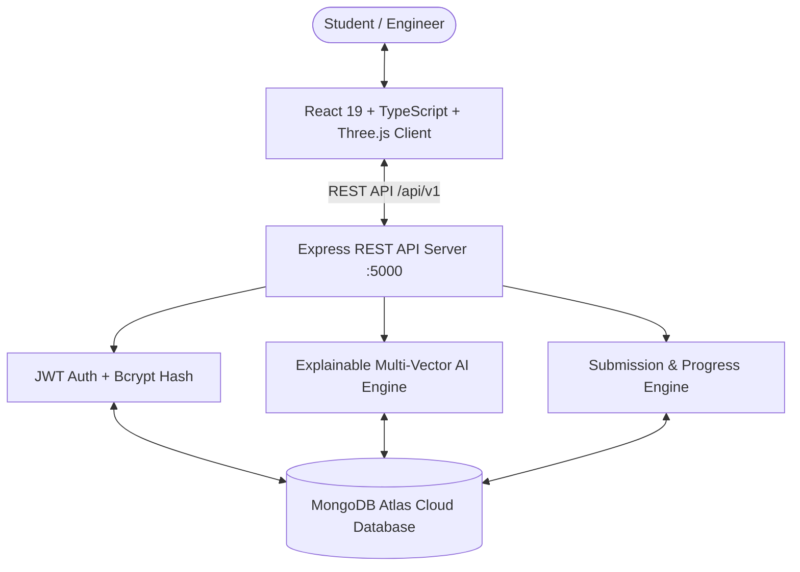

# 🌌 CareerPath – AI-Powered Personalized Career Guidance Platform

[](https://github.com/)
[](https://react.dev/)
[](https://www.typescriptlang.org/)
[](https://nodejs.org/)
[](https://expressjs.com/)
[](https://www.mongodb.com/atlas)
[](https://threejs.org/)
[](LICENSE)

> An intelligent, explainable career discovery and technical skill-acquisition platform combining **3D celestial spatial exploration**, **multi-vector explainable AI scoring**, **15-step interactive roadmaps**, **3,600+ assessment questions in MongoDB**, **in-browser coding sandbox**, and **GitHub project milestone verification**.

---

## 📑 Table of Contents

- [Key Highlights & Architecture](#-key-highlights--architecture)
- [System Features](#-system-features)
- [Database as Single Source of Truth](#-database-as-single-source-of-truth)
- [Tech Stack](#-tech-stack)
- [Quick Start & Installation](#-quick-start--installation)
- [Testing & Validation](#-testing--validation)
- [Deployment](#-deployment)
- [Project Documentation](#-project-documentation)
- [License](#-license)

---

## 🌟 Key Highlights & Architecture



---

## 🚀 System Features

1. **3D Celestial Career Sky (`/sky`)**:
   - 23 Industry Domains and 53 Subdomains positioned in 3D coordinate space `[x, y, z]` using Three.js and React Three Fiber.
   - Dynamic Drei 3D billboard labels with orbit controls, click-to-focus camera transitions, and smooth WebGL context restoration.

2. **Explainable Multi-Vector AI Recommendations (`/onboarding`)**:
   - 4-Vector Scoring Algorithm: Technical Skills (35%), Domain Interests (25%), Work Style (20%), and Feasibility (20%).
   - Generates 3 transparent natural-language rationales justifying *why* the career fits the candidate.

3. **15-Step Prerequisite Roadmaps (`/roadmap`)**:
   - 24 Comprehensive Careers (Android, iOS, ML, Web, Cyber Security, Cloud/DevOps, Quantum, Robotics, etc.) with 15 nodes each (**360 nodes total**).
   - Real-time roadmap topic search and interactive SVG 4-Phase Flow Diagram with auto-scroll anchor links.

4. **Rigorous Assessment Engine (3,600+ Questions in MongoDB)**:
   - Every single roadmap node has an assessment with **10+ technically meaningful MCQs**.
   - Timed testing, automated server-side grading, 70% passing bar, and detailed explanations for every choice.

5. **In-Browser Coding Sandbox (`/roadmap/challenge/:nodeId`)**:
   - Multi-language code editor with automated assertion test cases and solution repository linking.

6. **Milestone Project & GitHub Submissions (`/roadmap/task/:nodeId`)**:
   - Full milestone deliverables checklist with GitHub repository URL regex validation, live deployment links, architecture notes, and file attachments stored in MongoDB.

7. **Multi-Field Search (`/resources` & `/projects`)**:
   - Real-time search across 42 learning resources and 43 portfolio projects with filtering by difficulty, provider, and tech stack.

8. **Diagnostic Skill Gap & Career Readiness Index (`/skill-gap` & `/readiness`)**:
   - Visual radar gap analysis and mathematical readiness rating (0–100%).

---

## 📊 Database as Single Source of Truth

Verified counts in MongoDB Atlas:
- **Domains**: 23
- **Subdomains**: 53
- **Careers**: 24
- **Roadmaps**: 24 (15 nodes each = 360 nodes)
- **Courses**: 360
- **Assessments**: 360 (Exactly 10 questions each = 3,600 questions)
- **Coding Challenges**: 360
- **Practical Tasks**: 360
- **Projects**: 43
- **Resources**: 42

---

## 💻 Tech Stack

| Layer | Technologies |
| :--- | :--- |
| **Frontend** | React 19, TypeScript, Vite, Tailwind CSS, Three.js, React Three Fiber, Framer Motion, Lucide React, Axios |
| **Backend** | Node.js (>=20.x), Express.js, TypeScript, Mongoose ODM, JWT, bcryptjs, Zod, Helmet, Morgan |
| **Database** | MongoDB Atlas (Cloud NoSQL Database) |
| **DevOps & Deploy** | Vercel, Netlify, Render, Docker, Docker Compose, GitHub Actions |

---

## ⚡ Quick Start & Installation

### Prerequisites
- Node.js >= 20.x
- npm >= 10.x
- MongoDB Atlas Connection URI

### Step 1: Clone Repository
```bash
git clone https://github.com/your-username/career-path_V1.git
cd career-path_V1
```

### Step 2: Configure Environment Variables
Copy the template files:
```bash
# Frontend environment
cp .env.example .env

# Backend environment
cp server/.env.example server/.env
```

### Step 3: Install Dependencies
```bash
# Install frontend dependencies
npm install

# Install backend dependencies
cd server
npm install
cd ..
```

### Step 4: Seed Database (Idempotent)
```bash
cd server
npx tsx src/scripts/seed.ts
cd ..
```

### Step 5: Start Development Servers

**Terminal 1 (Backend API - Port 5000):**
```bash
cd server
npm run dev
```

**Terminal 2 (Frontend Client - Port 5173):**
```bash
npm run dev
```
Open **`http://localhost:5173`** in your browser.

---

## 🧪 Testing & Validation

Run the standalone validation scripts from the `server/` directory:

```bash
cd server

# 1. Run database relational integrity check (17-point check)
npm run validate:db

# 2. Run comprehensive 15-scenario automated test suite
npm run test:comprehensive
```

---

## 🌐 Deployment

Production deployment templates are included:
- **Frontend**: Deploy to [Vercel](https://vercel.com) using [`vercel.json`](vercel.json) or [Netlify](https://netlify.com) using [`netlify.toml`](netlify.toml).
- **Backend**: Deploy to [Render](https://render.com) or [Railway](https://railway.app) pointing to `server/`.
- **Docker**: Run `docker compose up -d --build` for containerized hosting.

For complete step-by-step instructions, see **[DEPLOYMENT_GUIDE.md](DEPLOYMENT_GUIDE.md)**.

---

## 📚 Project Documentation

| Document | Description |
| :--- | :--- |
| **[PROJECT_REPORT.md](PROJECT_REPORT.md)** | Full academic B.Tech project report with 45 detailed chapters. |
| **[PAGE_BY_PAGE_EXPLANATION_GUIDE.md](PAGE_BY_PAGE_EXPLANATION_GUIDE.md)** | Page-by-page technical blueprint and viva presentation speaking scripts. |
| **[DEPLOYMENT_GUIDE.md](DEPLOYMENT_GUIDE.md)** | Step-by-step production deployment instructions for Vercel, Render, and Docker. |
| **[HOW_TO_RUN_AND_TEST.md](HOW_TO_RUN_AND_TEST.md)** | Local execution instructions, test results, and UI walkthrough. |

---

## 📄 License

This project is licensed under the MIT License - see the [LICENSE](LICENSE) file for details.
